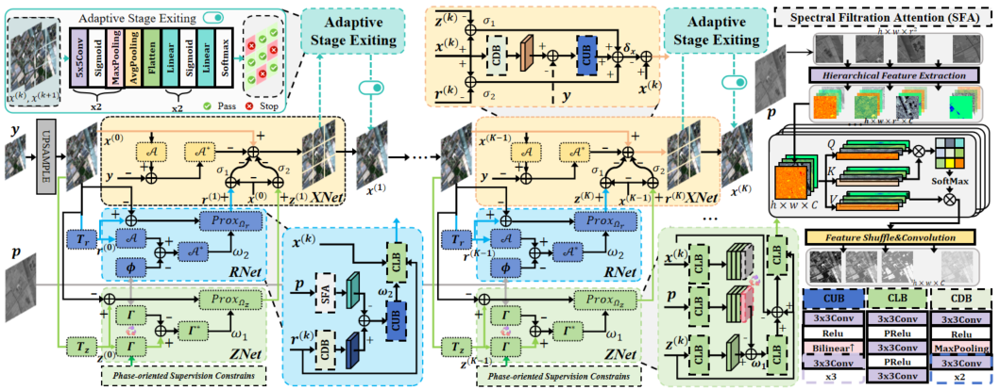
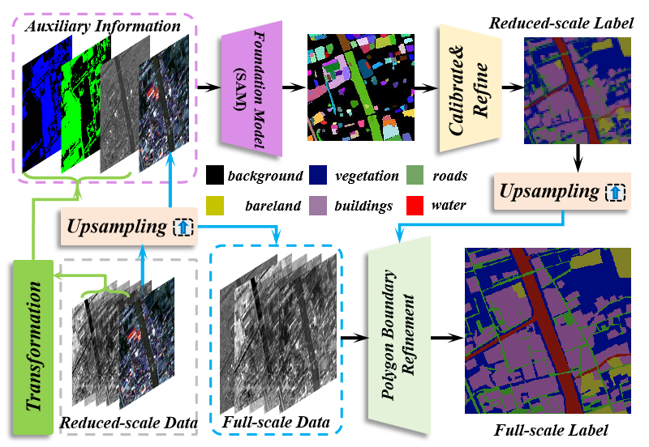

# Project

# Deep Adaptive Unfolded Network via Spatial Morphology Stripping and Spectral Filtration for Pan-sharpening

<em>Hebaixu Wang and Jiayi Ma </em>.

[Paper](https://openaccess.thecvf.com/content/ICCV2025/papers/Wang_Deep_Adaptive_Unfolded_Network_via_Spatial_Morphology_Stripping_and_Spectral_ICCV_2025_paper.pdf) |  [Github Code]([https://github.com/MiliLab/DGSolver](https://github.com/Baixuzx7/DAPNet))

## Abstract

In the field of pan-sharpening, existing deep methods are hindered in deepening cross-modal complementarity in the intermediate feature, and lack effective strategies to harness the network entirety for optimal solutions, exhibiting limited feasibility and interpretability due to their black-box designs. Besides, validating pan-sharpening performance in high-level semantic tasks is intractable for the absence of datasets. To tackle these issues, we propose a deep adaptive unfolded network via spatial morphology stripping and spectral filtration for pan-sharpening, which is conceptualized as a linear inverse problem regularized by spatial and spectral priors. Specifically, we incorporate phase-oriented constraints into the spatial prior to facilitate the extraction of modal-invariant spatial morphology by intrinsic decomposition and leverage a physics-driven spectral filtration attention mechanism aligned with the spectral prior to mine the inherent spectral correlation. After transparently unfolding the model into a multi-stage network, an adaptive stage-exiting mechanism is designed to capitalize on fusion diversity by aggregating optimal image patches across candidate stages. To systematically complete the assessment, we construct the first panoptic segmentation dataset as a semantic-level benchmark for pan-sharpening performance validation. Extensive experiments are conducted to verify the merits of our method with state-of-the-arts.

## Overview

## Visualization

## Datasets Information

[Google Cloud](https://drive.google.com/file/d/1cc7WkG2E8gGKEzBt7WZFXmkpV7VzLWk7/view?usp=drive_link)

[Baidu Cloud](https://pan.baidu.com/s/1AOGPsxD-IT0zqZ-pDzEjMQ?pwd=ygre)[ygre]

### Contributor

Baixuzx7 @ wanghebaixu@gmail.com

### Copyright statement

The project is signed under the MIT license, see the [LICENSE.md](https://github.com/Baixuzx7/DAPNet/blob/main/LICENSE)

### Reference

@inproceedings{wang2025deep,
  title={Deep Adaptive Unfolded Network via Spatial Morphology Stripping and Spectral Filtration for Pan-sharpening},
  author={Wang, Hebaixu and Ma, Jiayi},
  booktitle={Proceedings of the IEEE/CVF International Conference on Computer Vision},
  pages={10730--10740},
  year={2025}
}
